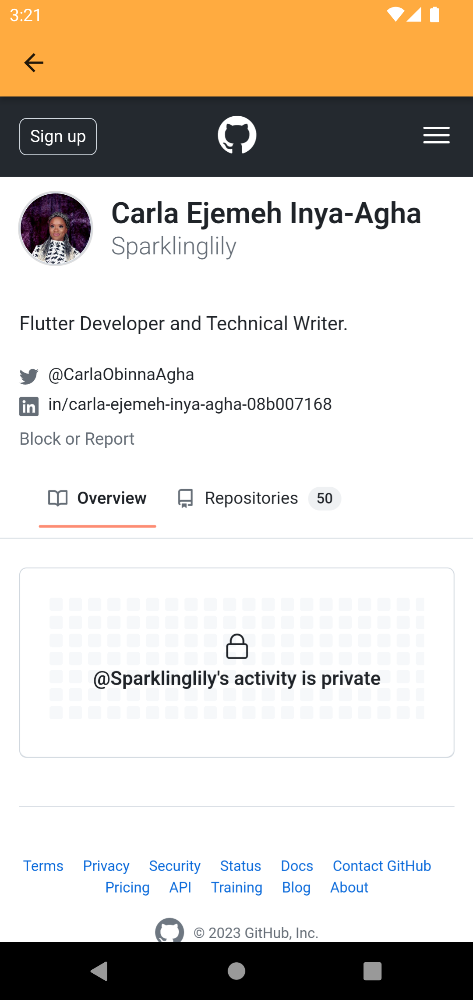
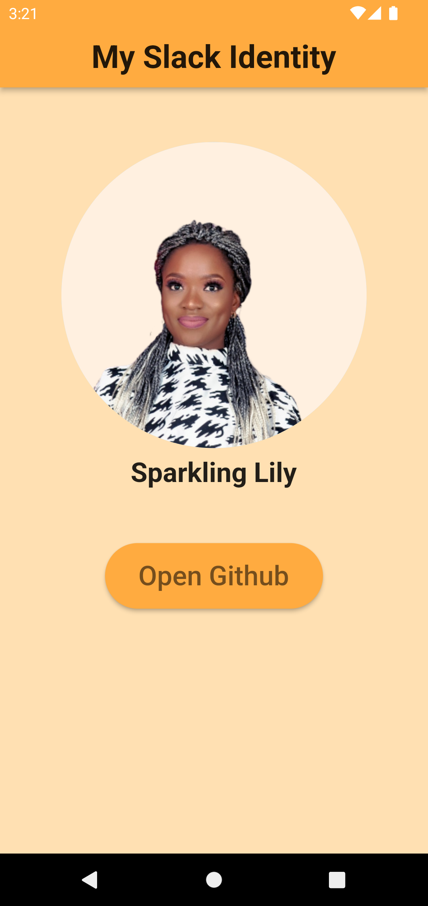

# A flutter App with a WebView component.

This project is simply a home-screen displaying my slack profile picture , my username and a button to open my github profile.
 Image:

### Appetize Link:

[Appetize](https://appetize.io/app/kzuz2lx6xmz5aipxgap2lvzny4?device=pixel4&osVersion=12.0&scale=75)

This App runs intuitively across all these device screens :pixel4, pixel 4xl,pixel 6, pixel 6 pro, 
pixel 7, pixel 7 pro, and galaxy tab s7. It also runs seamlessly on android versions 10,11 and 12.

#### Installation:

1. clone this repo by copying the code url and then paste it on your code editor. 
2. Run flutter pub get to load the necessary dependencies for the project and ensure the min-sdk on your code editor is between version 20/21.
3. Shoot! Ensure you already have a Flutter sdk installed on your system, for a seamless run. Version 3.10 -3.13 is fine for this project
4. Afterwards run the app by inputting "Flutter run" in your terminal. 
5. After a few minutes, the app should come up fine on your device or in the emulator.

### Packages:

The webView_Flutter 4.2.4 plugin was used to incorporate the web component into this project. With this plugin, flutter
widgets are easily rendered over the web. It works on ANDROID and IOS and has extensive provisions for both platforms.

